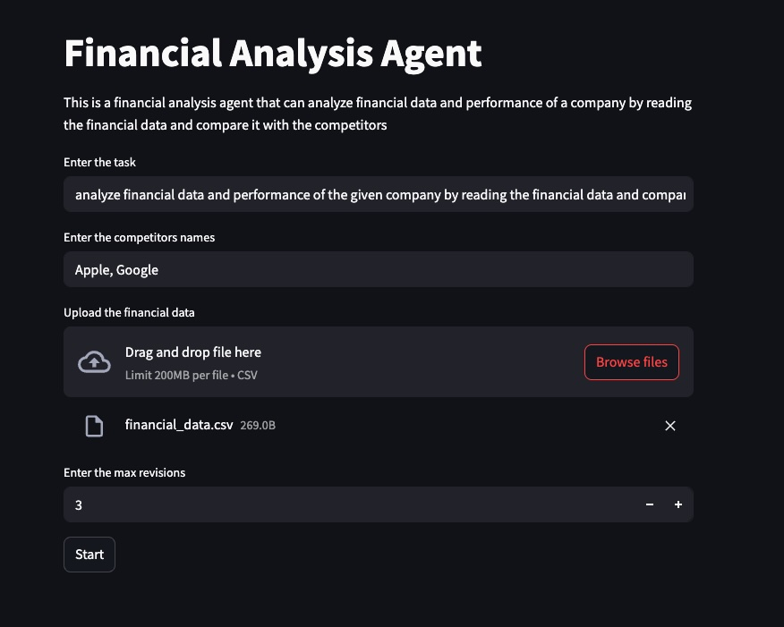
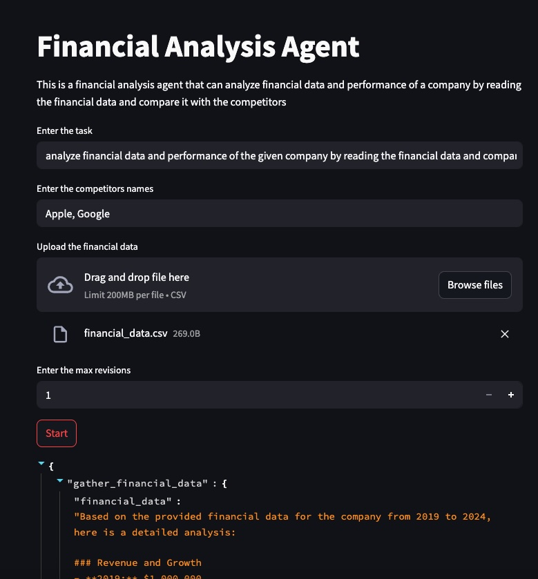
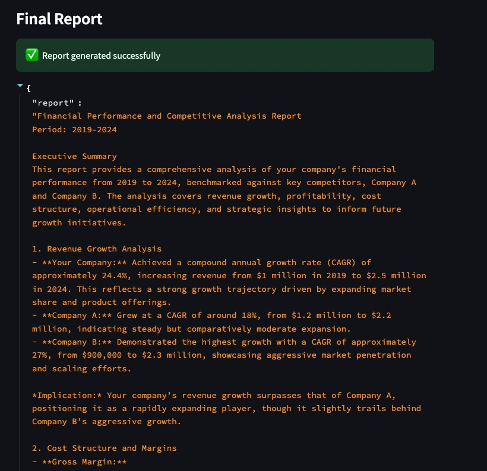
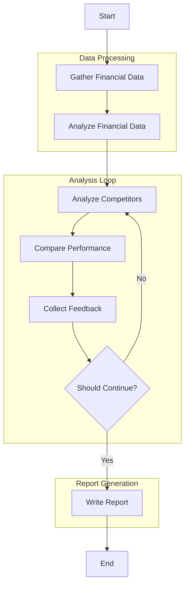

# Financial Analysis AI Agent

An intelligent agent that analyzes financial data, compares performance with competitors, and generates comprehensive reports using LangGraph and LangChain.

## About

This repository contains a sophisticated AI agent built with LangGraph and LangChain that automates financial analysis workflows. The agent processes financial data from CSV files, performs competitor analysis, and generates detailed reports with interactive feedback loops.

### Key Components

- **LangGraph Integration**: Uses LangGraph for building a robust agent workflow with state management and conditional branching
- **LangChain Framework**: Leverages LangChain for LLM interactions and tool integrations
- **Streamlit Interface**: Provides a user-friendly web interface for interacting with the agent
- **Tavily Search**: Integrates with Tavily for real-time competitor research
- **State Management**: Implements a custom state system for tracking analysis progress
- **Memory System**: Maintains context across multiple analysis iterations

### Architecture

The agent follows a modular architecture with clear separation of concerns:

- **Nodes**: Individual processing units for specific tasks
- **State**: Centralized state management for data flow
- **Tools**: External integrations (Tavily, LLM)
- **Interface**: Streamlit-based user interaction

### Use Cases

- Financial performance analysis
- Competitor benchmarking
- Automated report generation
- Interactive analysis refinement
- Data-driven decision support

## Features

- Financial data analysis from CSV files
- Competitor performance comparison
- Automated research using Tavily search
- Interactive feedback loop for report refinement
- Beautiful Streamlit interface
- Comprehensive test suite

## Project Structure

```
financial-ai-agent/
├── agent.py              # LangGraph agent definition and build
├── csv_data.py          # CSV data processing
├── data/                # Example data
├── images/              # Screenshots
├── main.py             # Streamlit application
├── memory.py           # Memory and thread management
├── model.py            # LLM integration
├── nodes.py            # Agent nodes
├── prompts.py          # System prompts
├── requirements.txt    # Dependencies
├── search_tool.py      # Tavily search integration
├── state.py            # State definitions
└── tests/              # Test suite
```

## Installation

1. Clone the repository:

```bash
git clone https://github.com/yourusername/financial-ai-agent.git
cd financial-ai-agent
```

2. Create and activate a virtual environment

3. Install dependencies:

```bash
pip install -r requirements.txt
```

4. Set up environment variables:
   - Copy `.env.example` to `.env`
   - Add your API keys:
     ```
     OPENAI_API_KEY=your_openai_api_key
     TAVILY_API_KEY=your_tavily_api_key
     ```

## Usage

1. Start the application:

```bash
streamlit run main.py
```

2. The application will open in your default web browser.

3. Input your analysis requirements:

   - Enter the task description
   - Specify competitor names
   - Upload your financial data CSV file
   - Set the maximum number of revisions

4. Click "Start" to begin the analysis.

## CSV File Format

The application expects financial data in CSV format. Here's an example structure:

```csv
year,revenue,cost_of_goods_sold,operating_expenses,net_income
2019,1000000,600000,250000,150000
2020,1200000,720000,280000,200000
2021,1500000,900000,300000,300000
2022,1800000,1080000,350000,370000
2023,2100000,1260000,400000,440000
2024,2500000,1500000,450000,550000
```

## Application Interface

### Stage 1: Input


The initial interface where you can:

- Enter your analysis task
- Specify competitors
- Upload financial data
- Set revision limits

### Stage 2: Processing


The agent will:

- Analyze financial data
- Research competitors
- Compare performance
- Generate initial report

### Stage 3: Final Report


The comprehensive report includes:

- Financial analysis
- Competitor comparison
- Performance metrics
- Strategic recommendations

## Testing

```bash
python -m pytest tests/
```

## Docker Deployment

### Prerequisites

- Docker installed on your system
- API keys for Tavily and OpenAI

### Building the Image

```bash
# Build the Docker image
docker build -t financial-ai-agent .
```

### Running the Container

Basic run:

```bash
docker run -d \
  -p 8501:8501 \
  -e TAVILY_API_KEY=your_key \
  -e OPENAI_API_KEY=your_key \
  --name financial-agent \
  financial-ai-agent
```

### Security Features

The Docker setup includes several security features:

- Non-root user execution
- Minimal base image (Python slim)
- Regular health checks
- Proper file permissions
- Clean dependency management
- Network isolation options
- Security-optimized runtime

### Accessing the Application

Once running, access the application at:

```
http://localhost:8501
```

### Container Management

```bash
# View logs
docker logs financial-agent

# Stop container
docker stop financial-agent

# Remove container
docker rm financial-agent

# View container status
docker ps -a
```

## Build Agent Flow


